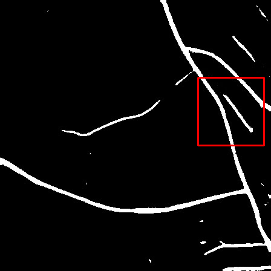

# 一个二值分割的评估工具
本工具用于在二值分割论文中的各种绘图、测评等...
## 使用介绍

目前已经实现的功能：
- "批量"将分割好，像素值为0 or 1的图象转化为0 or 255的可视化图象
- 设定好阈值，将像素点的RGB值转换为待分割物体/背景的二值图
- "批量"根据GroundTruth图象的识别情况，评估模型分割图的MIoU、Accuracy、Recall、Precision指标
- 画散点图
- "批量"在**不同模型**分割图中的指定位置画矩形图--标出明显的区域进行比较。如：
- 

TODO：
- 将GroundTruth图象与模型分割后的图结合，查看分割效果
## 使用说明

- `transform_Img.py`文件实现将GT文件夹下的像素值为0 or 1的图象 转化为 0 or 255的可视化图象并放在GT_binary里
- `measure.py`实现评估模型的单张预测图，具体路径可看该文件的main函数
- `draw_point.py` 画出散点图
- `mark.py` 直接run该文件后，配置好以“哪个图象为准进行标记”，随后用鼠标框选好要标记的区域，键入“回车”后即可完成`./image`下所有图象的标记。